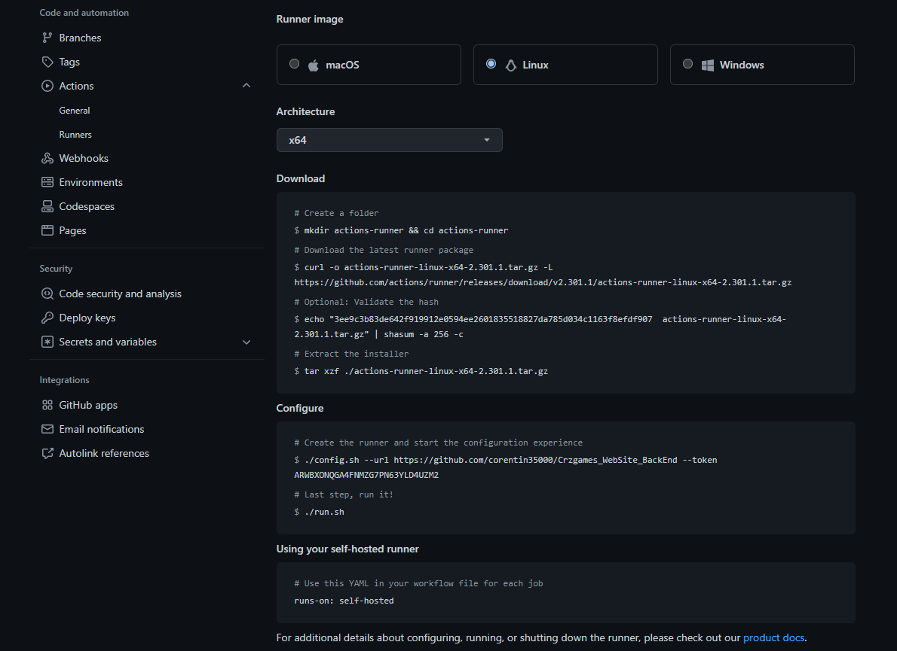

# Crzgames - WebSite / Back-end

## <span style="color: green;">Tech Stack 🛠</span>

- AdonisJS (framework back-end)
- NodeJS (environnement)
- MariaDB (database)
- Japa (tests unitaire/functional)
- CI / CD (Github actions)
- Docker

<br /><br /><br /><br />


## <span style="color: green;">Setup Environment</span>
1. Download and Install Docker Desktop : https://www.docker.com/products/docker-desktop/


<br /><br /><br /><br />


## <span style="color: green;">Cycle Development</span>
1. Open Docker Desktop
2. Run command :
```bash
   # Start the development server on http://localhost:3333 (AdonisJS)
   # Start the development server on http://localhost:8080 (phpmyadmin)
   # Start MariaDB port is : 3306

   docker-compose up
```

<br /><br /><br /><br />


## <span style="color: green">Updating Dependencies</span>
Pour voir les mise à jour des packages disponible de npm :
```bash
# npm
npm run npm:check:dependencies
```

Update depencencies all :
```bash
# npm
npm run npm:update:all-packages
```

<br /><br /><br /><br />


## <span style="color: green">Tests unitaire/functional</span>
### Development :
```sh
# npm
npm run test:unit-functional:dev
```

### Test/Staging/Production :
```sh
# npm
npm run test:unit-functional:test-staging-prod
```

<br /><br /><br /><br />


## <span style="color: green;">Production</span>
### Automatic - Pipeline CI/CD :
#### Setup - Si cela n'as jamais était encore fait :
1. Buy a VPS or a dedicated server with a Linux system with a fixed IPV4 (OVH, AWS..)
2. Connect to SSH for VPS.
3. Install runners auto-héberger and run runner. Go to your project repository, then to project settings, then click on 'Actions' then click on 'Runners' and click on 'New self-hosted runner'. Follow the documentation to install the self-hosted runner directly on the VPS by following their steps and launch the self-hosted runner : <br />
   
4. Run command (lance le runner auto-heberger en arrière plan, permet de quitter la session SSH sans couper le server qui contient le runners) :
```bash
nohup ./run.sh &
```
